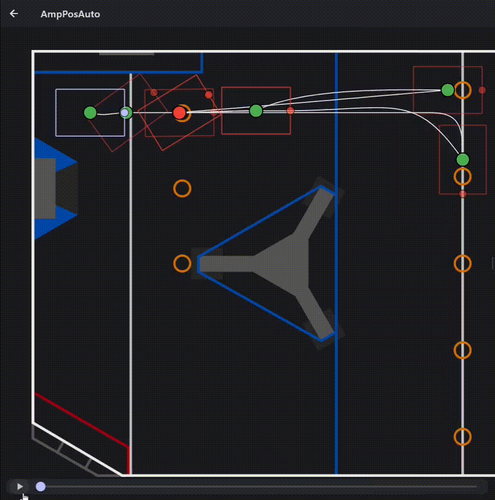
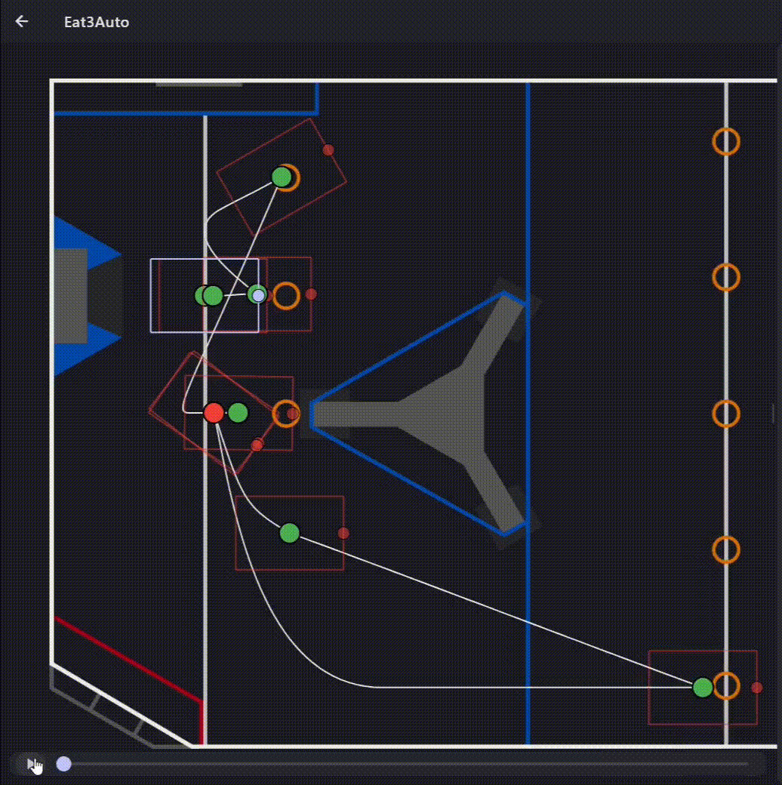

# 2024-RobotCode

This is the code repository for *Parasaur*, the FRC robot developed by Team 6947 Savage Tumaz for the 2023-2024 CRESCENDO Season. Parasaur competed in both the [Sacramento](https://www.thebluealliance.com/event/2024cada) (Rank 9, Alliance 4 First Pick) and [Central Valley](https://www.thebluealliance.com/event/2024cafr) (Rank 8, Alliance 4 First Pick) Regionals. We were honored to receive the Autonomous Award at the Sacramento Regional, and our team captain and head programmer, Aaron Lee, was named a Dean's List Award Finalist at the Central Valley Regional.

> In the crucible of competition, where the line between the autonomous period and teleop becomes a frontier for innovation, one team stands out by extending autonomous brilliance into the realm of teleoperation. Utilizing a sophisticated vision system, it not only localizes to its surroundings but hunts down Notes with the precision of a savage predator. Through the clever application of A-star and D-star algorithms, it seamlessly navigates the terrain plotting direct courses to the goals set by the drivers. - Central Valley Regional

[Full Engineering Notebook](.github/docs/engineering-notebook.pdf)

[Parasaur Robot Reveal](https://www.youtube.com/watch?v=mmL-eRspaGM)

## Features

- **[AdvantageKit](https://github.com/Mechanical-Advantage/AdvantageKit)** and **[AdvantageScope](https://github.com/Mechanical-Advantage/AdvantageScope)**: Leveraging advanced logging capabilities
    - *AdvantageKit logging was mostly taken off at the Sacramento Regional due to memory issues with our roboRIO 1 (Special thanks to 1678's Citrus Service for helping us debug this issue)*
- **[PhotonVision](https://photonvision.org/)**: Full-field AprilTag tracking and object detection for game pieces, integrated with WPILib's `SwervePoseEstimator`.
- **[PathPlanner](https://pathplanner.dev/home.html)**: Holonomic Mode commands for Autonomous Mode, featuring real-time path preview, generation, and automatic pathfinding with AD*.
- **Phoenix6 Integration**: Utilizing Velocity and DutyCycle controls for motors.
- **MK4i Swerve Field-Oriented Drivetrain**: Equipped with Falcon 500 motors, CANcoders, and NavX for precise control.
- **Set Shooter Angle**: Adjustable to any angle for accurate targeting.
- **AutoRise and AutoAim**: Automated speaker and note pickup mechanisms.

### Autonomous Routines

||AmpPos|**Eat3Auto** :trophy:|StagePos|
|--|--|--|--|
||||
|Expected Notes|4|5|4|
|Average Notes|2~3|4|2~3|

## Onboard Electronics

### Motors

|Subsystem|Type|Name|CAN Bus|CAN ID|Note|
|--|--|--|--|--|--|
|Swerve|Falcon 500|Drive|canivore|11,13,15,17|FL,FR,BL,BR|
|Swerve|Falcon 500|Angle|canivore|12,14,16,18|FL,FR,BL,BR|
|Swerve|Falcon 500|Cancoder|canivore|31,32,33,34|FL,FR,BL,BR|
|AngleSys|Falcon 500|Left|canivore|41|
|AngleSys|Falcon 500|Right|canivore|42|Follows 41, Invert|
|BottomIntake|Spark MAX (NEO Brushless Motor)|IntakeU|rio|55||
|BottomIntake|Spark MAX (NEO Brushless Motor)|IntakeD|rio|56|Follows 55, Same Direction|
|Climber|Falcon 500|Left|canivore|51|Independent|
|Climber|Falcon 500|Right|canivore|52|Independent|
|IntakeAngle|Spark MAX (NEO Brushless Motor)|Motor|rio|58|
|MidIntake|Spark MAX (NEO 550)|Motor|rio|57|
|Shooter|Spark MAX (NEO Brushless Motor)|Up|rio|62|
|Shooter|Spark MAX (NEO Brushless Motor)|Down|rio|61|

### Sensors / Encoders

|Subsystem|Type|Name|CAN Bus|CAN ID|Note|
|--|--|--|--|--|--|
|AngleSys|Spark MAX|Encoder|rio|43|no motor, only used as a controller for the SRX Mag Encoder|

|Subsystem|Type|Name|Header|Note|
|--|--|--|--|--|
|AngleSys|Limit Switch|Down Limit|DIO 9||
|AngleSys|Limit Switch|Up Limit|DIO 8||
|IntakeAngle|Limit Switch|Up Limit|DIO 0||
|IntakeAngle|Limit Switch|Down Limit|DIO 1||
|MidIntake|REV Color Sensor V3|Sensor|Onboard I2C||

### Coprocessor and Cameras

Utilizes an [Orange Pi 5 8GB](https://www.amazon.com/Orange-Pi-Frequency-Development-Android12/dp/B0BN17BRYY) running PhotonVision with an [AR0144](https://www.amazon.com/dp/B08CV2PVP7) for Object Detection and [OV9281](https://www.amazon.com/Arducam-Distortion-Microphones-Computer-Raspberry/dp/B096M5DKY6) for AprilTag localization. Pose estimation is handled on the coprocessor.

### LED

Employs a WS2812B addressable LED strip with 62 LEDs (31 on each side), connected to PWM Header 9. The LED displays the robot's state:

- Normal state: Streaming the alliance color :blue_square: :red_square:
- RIO booting: Solid white or streaming white :white_large_square:
- Picked up note: Solid yellow :yellow_square:
- Shooter activated: Streaming green :green_square:

## Acknowledgements

### Sponsors

- Micro-Star International Co., Ltd. [微星科技股份有限公司]
- Taiwan Auto Design Co.(TADC) [虎門科技股份有限公司]
- DELLIN DEVELOPMENT CORPORATION [德鄰建設股份有限公司]
- TON SIN ENGINEERING CORP. [同興營造工程]
- Chyuan Hsiang Machinery Factory Co., Ltd. [全祥機械廠股份有限公司]
- Shang Der Automation Co., Ltd. [上德自動化有限公司]
- TINO BELLINI AVENUE CO., LTD. [貝里尼股份有限公司]
- Taipei Fuhsing Private School

### Team Members

- **Captain/Lead Programmer:** Aaron Lee, Class of 2025
- **Technical Mentor:** Hank Wei (Meat Bun)
- **Mentor:** Dorcas Juan
- **Engineering Vice Captain/Chief Designer:** Jessica Lin (JL), Class of 2025
- **Chief Mechanical Engineer:** Cory Tseng, Class of 2025
- **PR and Business Vice Captain:** Cheryl Huang, Class of 2025
- **Chief Business Officer:** Hiro Lu, Class of 2025
- **Strategy Manager:** Walter Hsieh, Class of 2025
- **Deputy Captain/Mechanic:** Aaron Chen (Yi-Chia), Class of 2026
- **Mechanic:** Mars Chung, Class of 2026
- **Human Resources Manager:** Austin Wu, Class of 2025
- **Factory Manager:** Alexander Lin, Class of 2025
- **General Affairs:** Raymond Yeh, Class of 2025

### Drive Team

- **Drive Coach:** Hank Wei (Meat Bun)
- **Driver:** Austin Wu, Class of 2025
- **Operator:** Aaron Lee, Class of 2025
- **Driver 2:** Evan Chen, Class of 2026
- **Human Player/Technician:** Cory Tseng, Class of 2025
- **Human Player/Technician:** Mars Chung, Class of 2026

To all members of our team and everyone who helped us along the way, whether mentioned here or not: we extend our heartfelt thanks for your contributions and dedication.

*- Aaron Lee* 
*Team Captain* 
*April 28, 2024*
